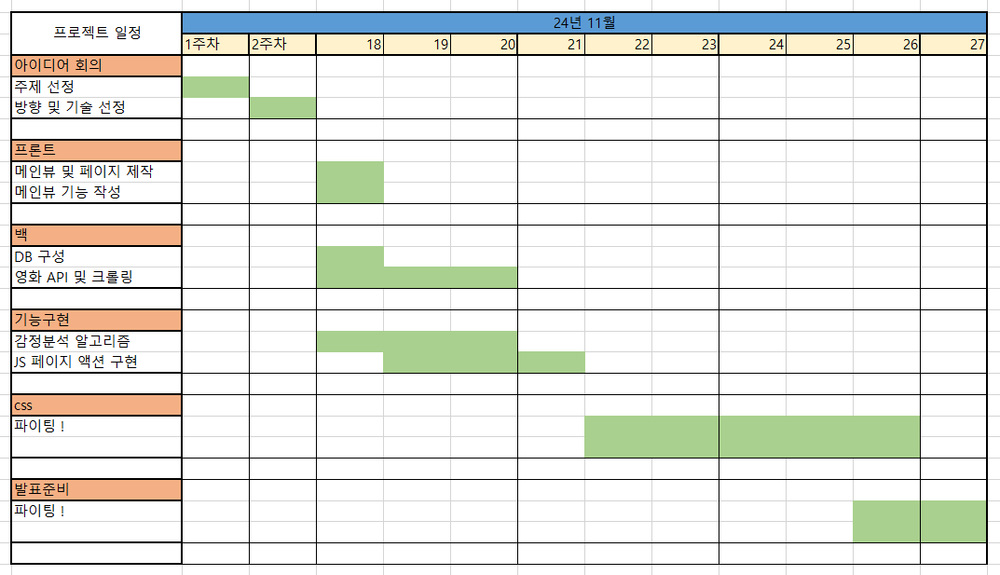
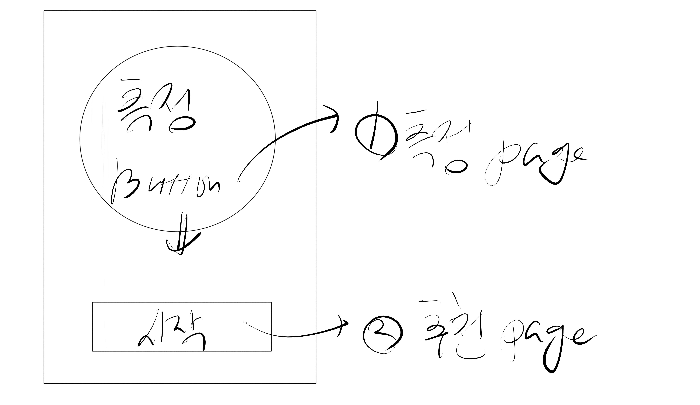
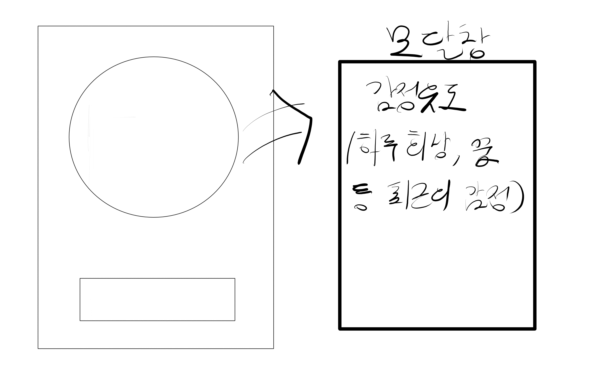
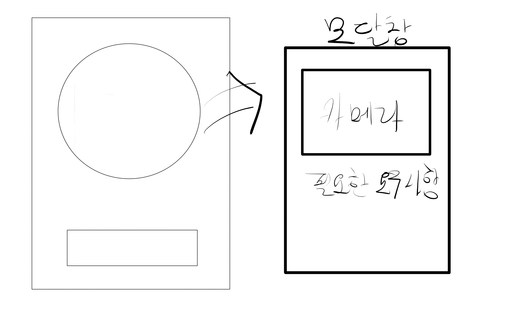
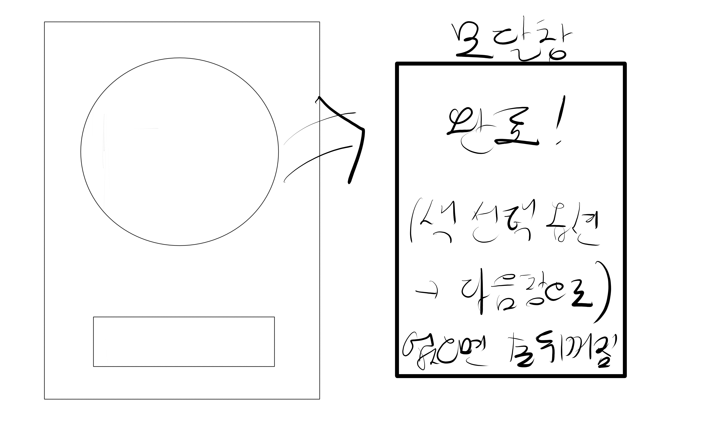
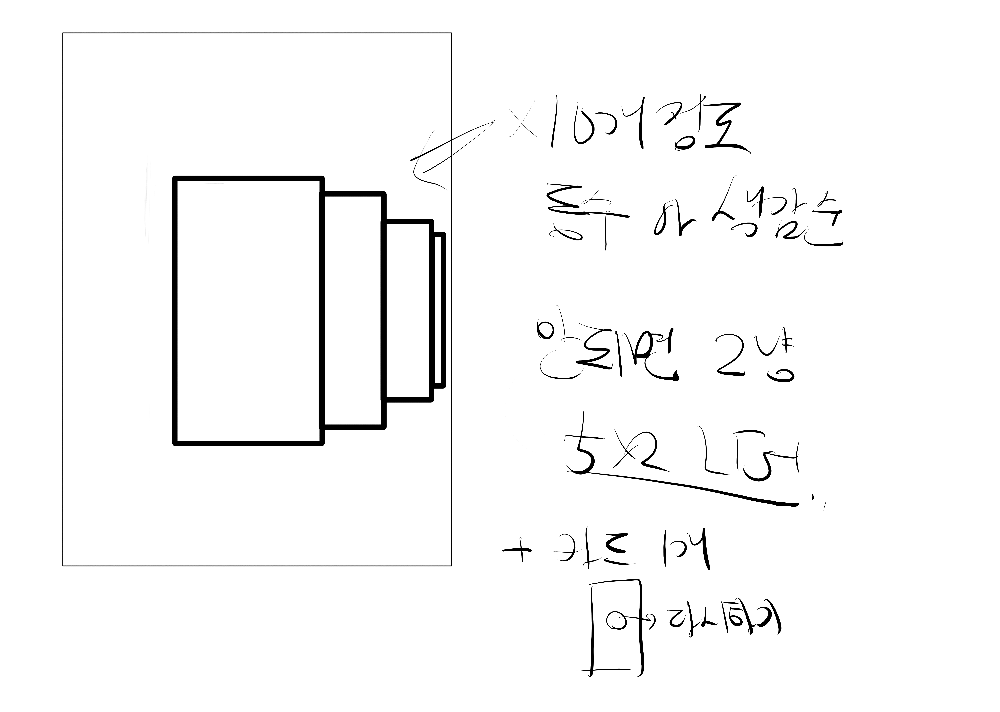
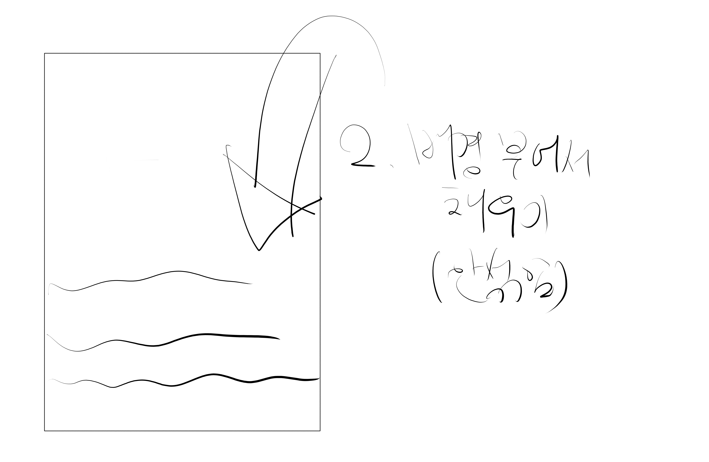
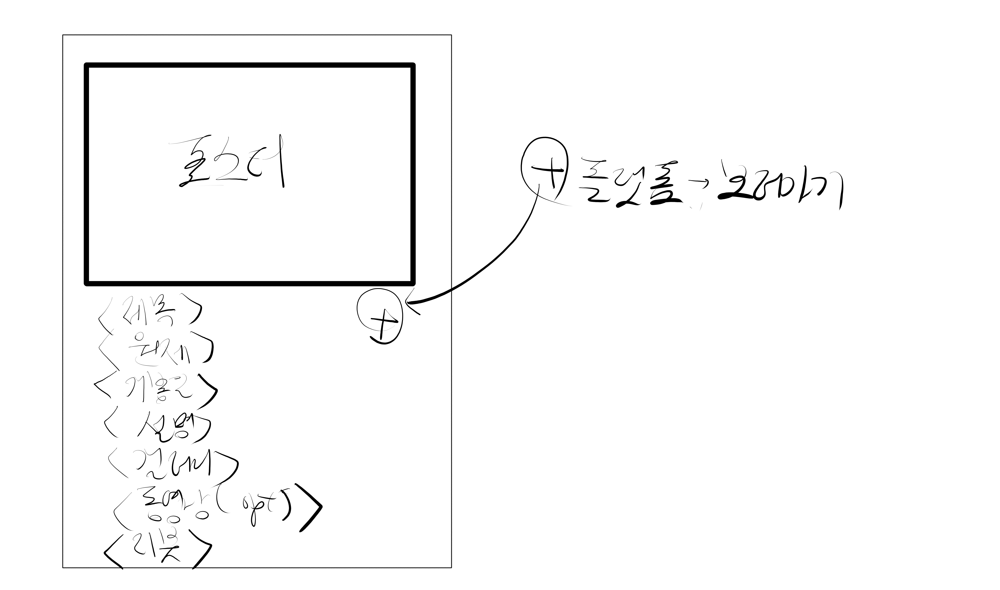

0. 아이템 선정

- 프로젝트 주제 : 사용자 `감정` 기반 영화 추천 서비스
- 이걸 왜 만들게 되었는가? :
  1. 영화를 볼거야. 근데 뭘 볼지 모르겠어. OR
  2. 고르는데 한 세월이야. 빨리 정하고 봐야되는데? OR
  3. 당사자의 현재 감정이 영화를 고르는데 중요한 지표가 된다 (자료1) 이렇게 고른 영화는 만족도를 올려준다. -> 근거가 필요하다.

* 자료는 추후 검색 요망.

0. 개요

- 프로젝트 명칭 : `감정의 색`

- 개발 인원 및 기간 : 2명 11/18~11/26

- 주요 기능 : 0. 준비물
  전처리할 데이터 (영화-포스터 연결 : 1000편 이상)

  1. 기술 반영 순서

  ```
  이전 기획
      - 사용자 감정 분석
          - 동영상, 사진V
          - 카메라 응시
          - 사진 10장정도 촬영
          - -> 사용할 기술

      - 감정에 따른 분류
          - 감정은 7가지
          - 7가지 항목(중립 하나)
          - 감정별로 영화 추천 리스트 작성
          - -> 사용할 기술

      - 감정의 퍼센테이지 만큼 영화의 비중이 바뀐다.
          - -> 사용할 기술

      - 감정, 색 데이터 통신
          1. 프론트에서 색감 정보
          2. 카메라 화면 웹에 띄우기
          3. 안면 인식
          4. 인식된 데이터 백으로 전달
          5. 백에서 (  )를 통해 영화 데이터 선별
          6. 선별 기준에 맞는 영화 정보 프론트로 전달
  ```

  **안면 인식 -> 감정 데이터 추출 -> 감정 기반 색 데이터 선별 -> 감정, 색 기반 영화 추천**

  2. 별점, 좋아요 기능(개인의 취향, 통계적인 것->개인정보를 확실하게 받아서 통계적으로 활용할 수 있도록.), OPTION
  3. CRUD(문의 게시판, 댓글), OPTION
  4. 검색? X
  5. 색감 -> 몇개를 쓸건가? -> 섞일 수 있는가?(데이터를 빡세게 모아야 겠지?) -> 색채심리학
  6. 감점 분석 -> 사용자가 선택한 색감 -> 감+색 추천
  7. 색감 뽑아내는 알고리즘? 가능할수도? API가 있는지 확인 : 존재

  **+** 8. 감정 데이터 추출 -> 딥러닝하면 제일 좋지만 데이터, 시간이 없고 검증이 안됨 -> 알고리즘 - 주감정, 부감정1, 2 선별, 장르 선택 9. 색 데이터 선별 -> 색채심리학 기반 감정별 어울리는 색 선별 - 주감정을 기준으로 명도, 채도 조절 (+ 애매하면 주감정도 색상 선별) - 부감정 기준 색상 선별 10. 영화 포스터(이후 값이 만족스럽지 않으면 스틸컷 등으로 변경) 기준 색상팔레트 제이슨파일에 넣음 - 장르, 색 기준 추천영화 10개

- 기술 스택 : JS, PYTHON, VUE3, DJANGO, SQLite, Git, DevOps(가능하면,)

1. MTV

   - ERD
     

2. 간트 차트

   

3. API 구성

   - TMDB
   - 왓챠피디아 크롤링

4. 와이어프레임(화면 설계서)

   - MainView
     
     
     
     

   - RecommendView
     
     
     

   - DetailPage
     

---

1. 개발 및 테스트

2. 배포?

---

1. README 및 포폴 작성

2. 회고

3. 문제와 해결

- 강사님 컴퓨터 성능이 너무 낮다
  - 외부에서 노트북 반입이 되는가?
